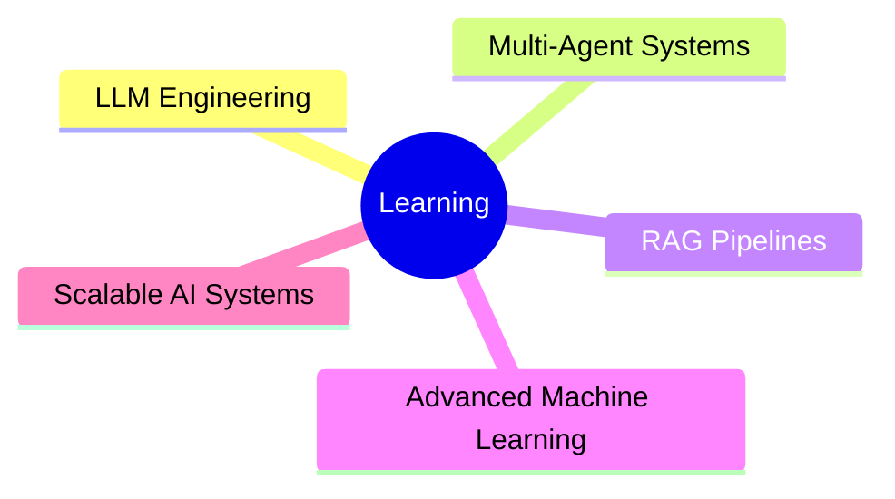

<div align="center">


</div>

---

# ⚡ ABOUT ME


```python
class KrishnaMukund:

    def __init__(self):
        self.role = "Aspiring AI/ML Engineer"
        self.location = "Hyderabad, India"
        self.languages = ["Python", "JavaScript"]

        self.interests = [
            "Machine Learning",
            "LLMs",
            "Multi-Agent Systems",
            "Deep Learning",
            "System Design"
        ]

        self.current_focus = [
            "LangGraph",
            "FAISS",
            "FastAPI",
            "RAG Pipelines",
            "Production AI Systems"
        ]

    def life_motto(self):
        return "Build AI that solves real-world problems 🚀"
```

---

# 🌐 CONNECT WITH ME

<div align="center">

<a href="mailto:krishnamukund2003@gmail.com">

</a>

<a href="https://github.com/krishnamukund450">

</a>

<a href="https://www.linkedin.com/in/krishna-mukund-parankusham-a20a30249">

</a>

</div>

---

# 🧠 TECH STACK

<div align="center">

### Languages & Frameworks


### AI / ML / LLM


### Tools & Platforms


</div>

---

# 🚀 FEATURED PROJECTS

<div align="center">

| 🚀 Project | 🔥 Description |
|---|---|
| **AI Operations Commander** | Autonomous Multi-Agent AI System with anomaly detection, planning, and memory using LangGraph + FAISS |
| **Suicide Detection in Twitter Streams** | NLP-based intelligent tweet monitoring system for detecting high-risk suicidal intent |
| **Face-to-BMI Detection** | Deep Learning model for BMI estimation using facial image analysis |

</div>

---

# 📊 GITHUB ANALYTICS

<div align="center">


</div>

---

# 🔥 CONTRIBUTION STREAK

<div align="center">


</div>

---

# 🐍 CONTRIBUTION SNAKE

<div align="center">


</div>

---

# 🏆 ACHIEVEMENTS

<div align="center">

🥇 Winner — College Gaming Contest  
📜 Kaggle Intermediate ML Certified  
🛡️ Cyber Security & UX Design Certified  

</div>

---

# ⚡ CURRENTLY LEARNING

<div align="center">



</div>

---

# ✨ RANDOM DEV QUOTE

<div align="center">


</div>

---

<div align="center">

## 🚀 BUILDING THE FUTURE WITH AI


</div>
